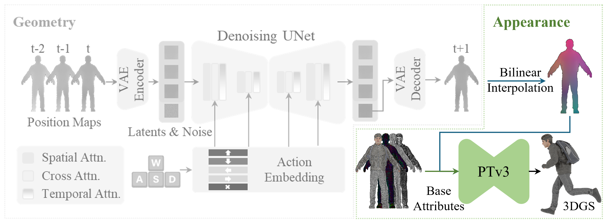

# UNICA — Appearance Stage


The Appearance stage refines coarse 3D Gaussian Splatting (3DGS) representations produced by the [Geometry stage](../Geometry/README.md) into high-fidelity Gaussian avatars. It takes position maps (EXR files) as input and outputs refined 3DGS files (PLY) via a **Point Transformer v3 (PTv3)** refiner network.


<br><br>

# Inference

## 1. Weight Preparation

Download pretrained weights from <https://huggingface.co/zjh21/UNICA> and place them in the `weights` path. The expected structure is:

```
weights/                              # at the root path
├── berserker/ 
│   ├── base_attrmap.npy
│   ├── ptv3.pth
├── cowgirl/ 
│   ├── base_attrmap.npy
│   ├── ptv3.pth
├── ...

Appearance/
├── configs/inference.yaml
├── inference.py
```

## 2. Input Data Structure

The expected input is the output of the **Geometry stage** — a directory containing EXR position maps. Only the `.exr` files are required for the Appearance stage.

```
results/berserker/0-w_00001_Idle/
├── 0_Forward.exr
├── 1_Forward.exr
├── ...
├── 100_Backward.exr
├── 101_Backward.exr
├── ...
├── 121_Left.exr
├── ...
└── {frameIndex}_{direction}.exr
```

> Each `.exr` file is a position map encoding the 3D surface positions of the avatar at a given frame.

If you plan to use `--progressive`, the input directory should also contain corresponding `.npy` files (saved by running `Geometry/inference.py` with `save_npy=true`).

## 3. Running Inference

Update `configs/inference.yaml` with the correct paths to your input directory, output directory, attribute map, and model checkpoint. Then run:

```bash
python inference.py --config configs/inference.yaml --progressive
```

The `--progressive` argument enables **progressive 4D inference**, which moves the refined avatars from normalized space to world-coordinate positions via Procrustes analysis. This requires `.npy` position-map files to be present in the input directory. If they are not found, inference will still proceed with normalized-space refinement.

### 4. Output Format

The output is a directory of `.ply` files with **one-to-one correspondence** to the input `.exr` files:

```
results/berserker/3dgs/
├── 0_Forward.ply
├── 1_Forward.ply
├── ...
├── 100_Backward.ply
├── 101_Backward.ply
├── ...
└── {frameIndex}_{direction}.ply
```

<br><br>


# Training

🚧 We are still in the process of cleaning up the training code. In the meantime, we are preparing a data acquisition guide to help you prepare the training data. Below is an example of how to run the training once the data is ready.

## 1. Training Data Structure

The training dataset consists of paired **position maps** (`.exr`) and **ground-truth renders** (`.png`) organized by motion clips:

```
posmap_3dgs/
├── 0-a/                              # motion clip directory
│   ├── 00001.exr                     # position map (input)
│   ├── 00002.exr
│   ├── ...
├── 0-d/
│   ├── ...
├── a-0-lfoot/
│   ├── ...
├── ...
└── w-s-rfoot/
    └── ...
```

Update `configs/train.yaml` to point to your data directories:

- **`data.posmap_root`** — path to the `posmap_3dgs/` directory above
- **`data.attribute_map_path`** — path to the shared base attribute map (`.npy`)
- **`data.renders_root`** — path to the ground-truth renders directory
- **`data.output_dir`** — path for saving checkpoints

### 2. Launching Training

Training uses [Accelerate](https://huggingface.co/docs/accelerate) for multi-GPU support:

```bash
accelerate launch train.py --config configs/train.yaml
```
